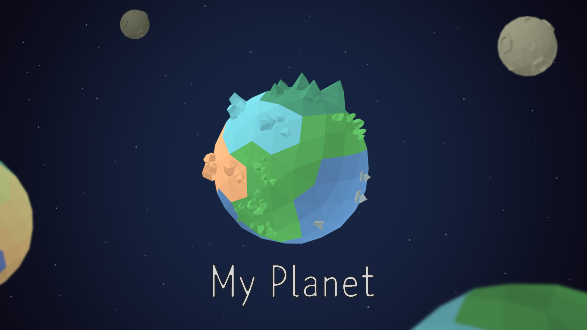

# Bridge_UnityProject
__Bridge_UnityProject 저장소에 방문해주셔서 감사합니다! :)__  (Ver.180908)

> 이 프로젝트는, 대학생연합 게임 제작 동아리 Bridge의 2018년도 후반기 프로젝트 중 하나입니다.
>
> 연합동아리 Bridge에 관한 정보는 [여기에서][3] 확인할 수 있습니다. 

About Team
-----------
> 팀 해솔Lead는 디자이너 2명, 아트 2명, 사운드 1명, 프로그래머 3명으로 총 8명으로 구성되어있습니다.

About Project
-----------
> Client
> *제작엔진은 유니티엔진이며, 플랫폼은 모바일(안드로이드)입니다. 장르는 1대1 PvP 보드게임입니다.

>__프로젝트 진행 상황 확인__
>* ~~[Trello Link]~~
>* ~~[Task Lisk Link]~~

프로젝트가 진행됨에 따라, 추가 업데이트하도록 하겠습니다 :)
감사합니다! 

[1]:https://trello.com/b/TgByYHu4
[2]:https://1drv.ms/x/s!Aklug0TlCKIJjEoRS-8XqkUFkZ7z
[3]:http://bridgegames.tistory.com/
