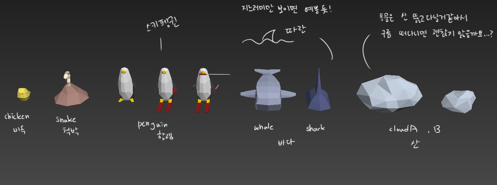
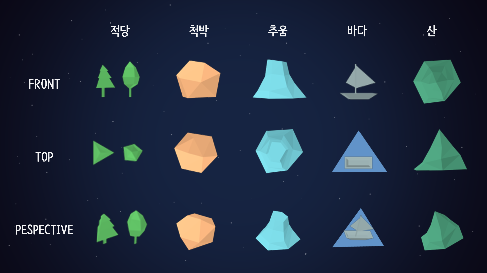

# Bridge_UnityProject
__Bridge_UnityProject 저장소에 방문해주셔서 감사합니다! :)__  (Ver.181226)

> 이 프로젝트는, 대학생연합 게임 제작 동아리 Bridge의 2018년도 후반기 프로젝트 중 하나입니다.
>
> 연합동아리 Bridge에 관한 정보는 [여기][3]에서 확인할 수 있습니다. 
>
>[Line 공모전 영상 링크](https://drive.google.com/open?id=1rAzn8OSSOXjcGaFGMRajK28J-X8GggUw) <- 클릭 시, 영상을 확인 할 수 있습니다.

About Team
-----------
> 팀 해솔Lead는 디자이너 2명, 아트 2명, 사운드 1명, 프로그래머 3명으로 총 8명으로 구성되어있습니다.

About Project
-----------
> Client (C#)
>* 제작엔진은 유니티엔진이며, 플랫폼은 모바일(안드로이드)입니다. 인게임은 3D로 개발됩니다.

> Server (C++)
> * IOCP Server 개발 후 유니티 연동합니다.

About Concept Image
-----------

_프로젝트 진행상황을 비공개로 전환했습니다._
>~~__프로젝트 진행 상황 확인__~~
>* ~~[Trello Link]~~
>* ~~[Task Lisk Link]~~

프로젝트가 진행됨에 따라, 추가 업데이트하도록 하겠습니다
감사합니다! :) 

[1]:https://trello.com/b/TgByYHu4
[2]:https://1drv.ms/x/s!Aklug0TlCKIJjEoRS-8XqkUFkZ7z
[3]:http://bridgegames.tistory.com/
